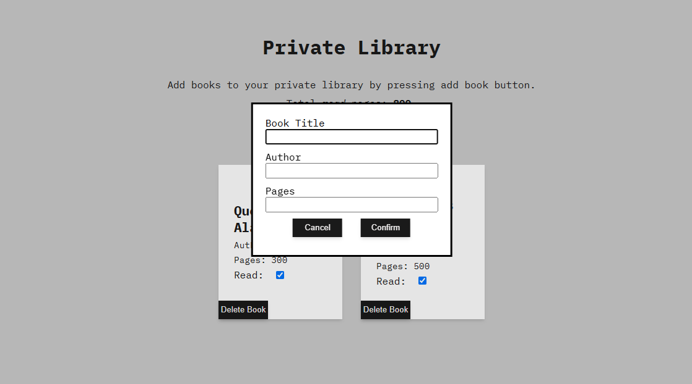

# Library

This project is part of [The Odin Project](https://www.theodinproject.com/lessons/node-path-javascript-library) curriculum. The goal was to build a simple library application that allows users to add, display, and manage books using HTML, CSS, and Vanilla JavaScript.

### Features

- **Add New Books**: Users can input the book's title, author and number of pages via form.
- **Display Books**: Books are displayed on the page as individual cards, showing their details.
- **Remove Books**: Each book card includes a button to remove the book from the library.
- **Toggle Read Status**: Users can change the read status of each book directly from its card.

### How to Use

1. **Add a Book**: Click the "Add Book" button to open the input form. Fill in the book details and submit.
2. **View Books**: All books will be displayed as cards on the page.
3. **Remove a Book**: Click the "Remove" button on a book's card to delete it from the library.
4. **Toggle Read Status**: Click the "Toggle Read Status" button on a book's card to update its read status.

### Technologies Used

- **HTML**: Structures the library interface.
- **CSS**: Styles the book cards and form for a clean user experience.
- **JavaScript**: Manages the book objects, user interactions, and DOM updates.

### Installation

1. Clone the repository:
   ```bash
   git clone https://github.com/igcarvalhaes/library.git
   ```

### Screenshots




---

# Biblioteca

Este projeto faz parte do currículo do [The Odin Project](https://www.theodinproject.com/lessons/node-path-javascript-library). O objetivo foi criar uma aplicação simples de biblioteca que permite aos usuários adicionar, exibir e gerenciar livros usando HTML, CSS e JavaScript puro.

### Funcionalidades

- **Adicionar Novos Livros**: Os usuários podem inserir o título do livro, autor e número de páginas pelo formulário.
- **Exibir Livros**: Os livros são exibidos na página como cartões individuais, mostrando seus detalhes.
- **Remover Livros**: Cada cartão de livro inclui um botão para removê-lo da biblioteca.
- **Alternar Status de Leitura**: Os usuários podem alterar o status de leitura de cada livro diretamente no cartão.

### Como Usar

1. **Adicionar um Livro**: Clique no botão "Add Book" para abrir o formulário de entrada. Preencha os detalhes do livro e envie.
2. **Visualizar Livros**: Todos os livros serão exibidos como cartões na página.
3. **Remover um Livro**: Clique no botão "Remover" no cartão de um livro para excluí-lo da biblioteca.
4. **Alternar Status de Leitura**: Clique no botão "Alternar Status de Leitura" no cartão de um livro para atualizar seu status de leitura.

### Tecnologias Utilizadas

- **HTML**: Estrutura a interface da biblioteca.
- **CSS**: Estiliza os cartões de livros e o formulário para uma experiência de usuário limpa.
- **JavaScript**: Gerencia os objetos de livros, interações do usuário e atualizações do DOM.

### Instalação

1. Clone o repositório:
   ```bash
   git clone https://github.com/igcarvalhaes/library.git
   ```
